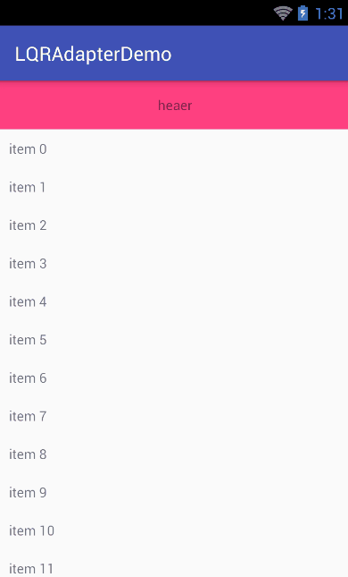

# LQRAdapterLibrary
万能适配器（RecyclerView、ListView、GridView）

###只需要导入一句即可使用两种适配器：

	compile 'com.lqr.adapter:library:1.0.0'

##***一、LQRAdapterForAbsListView***

###1、创建适配器
LQRAdapterForAbsListView&lt;数据类型&gt;（上下文，数据集合，item的布局引用）
###2、在convert方法中对item进行数据设置
###3、例子：
	private List<String> mData = new ArrayList<>();
    for (int i = 0; i < 100; i++) {
        mData.add("item " + i);
    }

	//ListView
    mLv.setAdapter(new LQRAdapterForAbsListView<String>(this, mData, R.layout.item_tv_list) {
        @Override
        public void convert(LQRViewHolderForAbsListView helper, String item, int position) {
            helper.setText(R.id.tv, item);
        }

    });

    //GridView
    mGv = (GridView) findViewById(R.id.gv);
    mGv.setAdapter(new LQRAdapterForAbsListView<String>(this, mData, R.layout.item_tv_list) {
        @Override
        public void convert(LQRViewHolderForAbsListView helper, String item, int position) {
            helper.setText(R.id.tv, item);
        }

    });
###4、helper的使用
LQRViewHolderForAbsListView中提供了许多常规用的控件操作，如设置文字、文字颜色、背景、显隐等，同时每个方法都是返回this，这意味着可以链式操作，方便快速开发。

##***二、LQRAdapterForRecyclerView***
###1、创建适配器
LQRAdapterForRecyclerView&lt;数据类型&gt;（上下文，数据集合，item的布局引用）
###2、在convert方法中对item进行数据设置
###3、例子：
	//RecyclerView
	mRv.setAdapter(new LQRAdapterForRecyclerView<String>(this, R.layout.item_tv_list, mData) {
        @Override
        public void convert(LQRViewHolderForRecyclerView helper, String item, int position) {
            helper.setText(R.id.tv, item);
        }
    });
###4、helper的使用
LQRViewHolderForRecyclerView中提供了许多常规用的控件操作，如设置文字、文字颜色、背景、显隐等，同时每个方法都是返回this，这意味着可以链式操作，方便快速开发。
###5、添加头部、尾部

	LQRAdapterForRecyclerView<String>  mAdapter = new LQRAdapterForRecyclerView(...);
	//必须使用HeaderAndFooterAdapter作为RecyclerView的适配器
	mRv.setAdapter(mAdapter.getHeaderAndFooterAdapter());

	//添加头部
	private void testAddHeaderView() {
        TextView tv = new TextView(this);
        ...
        tv.setText("heaer");
        mAdapter.addHeaderView(tv);
    }

	//添加尾部
    private void testAddFooterView() {
        TextView tv = new TextView(this);
        ...
        tv.setText("footer");
        mAdapter.addFooterView(tv);
    }

###6、多视图类型支持（viewType）
若项目中需要用到多种条目视图类型，则需要重新getItemViewType方法，其返回值是不同类型对应的视图布局资源id，如：

	private static final int NOTIFICATION = R.layout.item_notification;
    private static final int SEND_TEXT = R.layout.item_text_send;
    private static final int RECEIVE_TEXT = R.layout.item_text_receive;
    private static final int SEND_STICKER = R.layout.item_sticker_send;
    private static final int RECEIVE_STICKER = R.layout.item_sticker_receive;
    private static final int SEND_IMAGE = R.layout.item_image_send;
    private static final int RECEIVE_IMAGE = R.layout.item_image_receive;
    private static final int SEND_VIDEO = R.layout.item_video_send;
    private static final int RECEIVE_VIDEO = R.layout.item_video_receive;
    private static final int SEND_LOCATION = R.layout.item_location_send;
    private static final int RECEIVE_LOCATION = R.layout.item_location_receive;

    @Override
    public int getItemViewType(int position) {
        IMMessage msg = getData().get(position);
        MsgTypeEnum msgType = msg.getMsgType();
        if (msgType == MsgTypeEnum.notification) {
            return NOTIFICATION;
        }
        if (msgType == MsgTypeEnum.text) {
            if (msg.getDirect() == MsgDirectionEnum.Out) {
                return SEND_TEXT;
            } else {
                return RECEIVE_TEXT;
            }
        }
        if (msgType == MsgTypeEnum.custom) {
            if (msg.getDirect() == MsgDirectionEnum.Out) {
                return SEND_STICKER;
            } else {
                return RECEIVE_STICKER;
            }
        }
        if (msgType == MsgTypeEnum.image) {
            if (msg.getDirect() == MsgDirectionEnum.Out) {
                return SEND_IMAGE;
            } else {
                return RECEIVE_IMAGE;
            }
        }
        if (msgType == MsgTypeEnum.video) {
            if (msg.getDirect() == MsgDirectionEnum.Out) {
                return SEND_VIDEO;
            } else {
                return RECEIVE_VIDEO;
            }
        }
        if (msgType == MsgTypeEnum.location) {
            if (msg.getDirect() == MsgDirectionEnum.Out) {
                return SEND_LOCATION;
            } else {
                return RECEIVE_LOCATION;
            }
        }
        return super.getItemViewType(position);
    }

以上是本人项目中用到的代码，以此作为参考。

###7、其他

建议与LQRRecyclerView一起使用，不需要考虑LayoutManager和分割线的情况，开发效率大大提高。